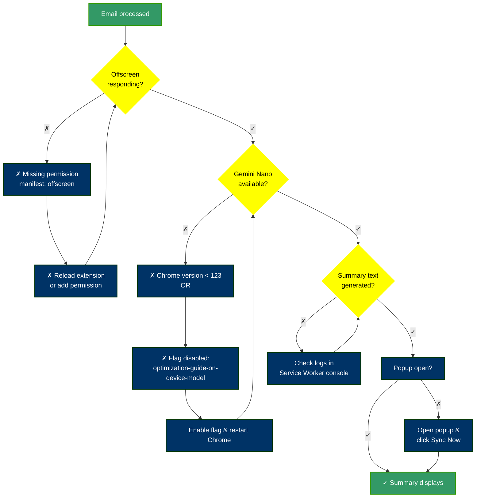

# Implementation Notes

## Message Contracts

**Service Worker ↔ Popup:**

- `SYNC_STATUS`: Broadcast sync state (idle, syncing, error)
- `NEW_EMAILS`: Broadcast processed emails with summaries and labels
- `TRIGGER_SYNC_NOW`: Manual sync request from popup
- `CLEAR_HISTORY`: Clear stored history on user request

**Service Worker ↔ Offscreen:**

- `PROCESS_EMAIL`: Send email body for NLP pre-filtering
- `PROCESSED_EMAIL_RESULT`: Return filtered text, labels, and metadata

## Why Two-Stage NLP?

1. **Wink (deterministic, cheap)**: Removes boilerplate using patterns. ~100ms per email.
2. **Gemini Nano (statistical, expensive in tokens)**: Summarizes filtered content only. ~300ms per email + token cost.

**Benefit**: By pre-filtering with Wink, you reduce token consumption to Gemini by 40-60%, cutting both cost and latency.

### Why Offscreen Document?

Chrome Extension restrictions prevent running complex DOM-dependent libraries in service workers. The offscreen document:

- Runs in a sandbox with access to `document`
- Enables Wink NLP (which internally uses the DOM for text parsing)
- Stays lightweight and isolated from the main UI
- Communicates via type-safe message passing

## Pattern Design Philosophy

Email patterns (in `lib/nlp/emailPatterns.ts`) mix:

- **Literal tokens**: `[best] [regards]`, `[unsubscribe]`
- **POS tags**: `[VERB]`, `[NOUN]`, `[DATE]` (from Wink's Universal POS tagset)
- **Negation patterns**: `[|ADJ]` (optional adjective)

This allows surgical pattern matching without full regex complexity:

- `[by] DATE` matches "by March 15" or "by 2026-03-15"
- `[sent] [from] [my] [NOUN]` matches "sent from my iPhone", "sent from my desktop"
- `[can] [you] [please] [VERB]` matches "can you please review", "can you please approve", etc.

## Diagnostic Flow (If "(No summary)" Appears)

**Root Causes & Fixes:**

