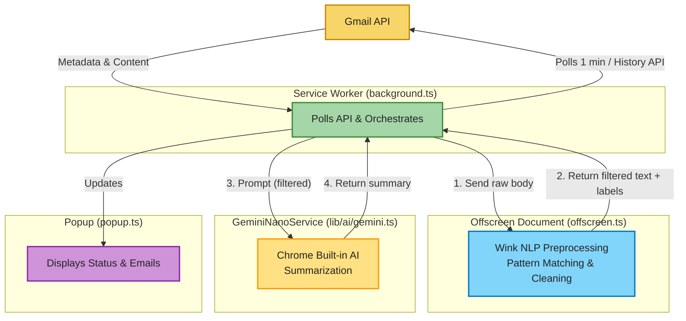

# Gmail TLDR

Chrome Extension (Manifest V3) for intelligent Gmail email processing with type-safe messaging
architecture and on-device NLP-powered summarization.

## Features

- **Polling-based Email Sync**: Service Worker periodically checks for new Gmail messages (1-minute intervals)
- **Wink NLP Pre-filtering**: On-device pattern matching to strip noise (signatures, legal disclaimers, unsubscribe blocks) before LLM processing
- **Gemini Nano Summarization**: On-device LLM (Chrome 123+) that produces concise summaries of filtered email content
- **Type-Safe Messaging**: Discriminated union pattern for inter-component communication (no stringly-typed messages)
- **OAuth 2.0 Integration**: Native Chrome identity API for authentication
- **Persistent State**: Chrome storage for `historyId` tracking

## Architecture

### Two-Stage NLP Pipeline



## Setup

### Prerequisites

- Node.js 18+
- TypeScript 5.3+
- Chrome 88+ (Gmail API support)
- Chrome 123+ (for Gemini Nano on-device LLM)

### Installation

```bash
npm install
npm run build
```

### Configuration

1. Create a Google Cloud project and enable the Gmail API
2. Create OAuth 2.0 credentials for Chrome Extension
3. Update `manifest.json` with your `client_id`
4. Load the extension in Chrome:
   - `chrome://extensions/`
   - Enable "Developer mode"
   - "Load unpacked" → select `dist/` folder
5. Enable Gemini Nano (if available):
   - `chrome://flags/#optimization-guide-on-device-model`
   - Set to "Enabled"

## Development

```bash
# Watch TypeScript compilation
npm run watch

# Lint code
npm run lint

# Format code
npm run format
```

## How It Works

### Example: Email Processing Flow

**Raw email from Gmail API:**

```txt
Subject: Action Required: Q1 Budget Review
From: manager@company.com
Body:
  Hi John,

  Hope you are doing well. I wanted to circle back on the Q1 budget review.

  Please review the attached spreadsheet and confirm your department's headcount
  needs by Friday, March 15th.

  Action items:
  - Review budget breakdown
  - Update headcount forecast
  - Reply with approval

  Thanks for your quick turnaround on this.

  Best regards,
  Sarah
  Manager, Finance

  --
  This email and any attachments may contain confidential information intended
  solely for the use of the addressee. If you are not the intended recipient,
  please delete it and notify the sender.

  [Company Legal Footer]
  [Unsubscribe]
```

**After Wink NLP pre-filtering:**

```txt
Q1 budget review. Please review the attached spreadsheet and confirm your
department's headcount needs by Friday, March 15th. Action items:
- Review budget breakdown
- Update headcount forecast
- Reply with approval

Labels: ["actionable", "possible_deadline"]
Dropped blocks: ["greeting", "signature", "legal_footer", "chatter"]
```

**After Gemini Nano summarization:**

```txt
TLDR: Manager needs Q1 budget review + headcount forecast by March 15.

Action items:
- Review budget spreadsheet
- Update headcount forecast
- Send approval by Friday

Confidence: high (clear deadline and action items)
```

**Rendered in popup:**

```txt
┌────────────────────────────────────────────────────────────────┐
│ From: manager@company.com                                      │
│ Subject: Action Required: Q1 Budget Review                     │
│                                                                │
│ Manager needs Q1 budget review + headcount forecast by         │
│ March 15.                                                      │
│                                                                │
│ [actionable] [possible_deadline]                               │
│                                                                │
│ Tokens: 47                                                     │
└────────────────────────────────────────────────────────────────┘
```

Optional:

1. Add company-specific patterns (e.g., internal email signatures)
2. Tune pattern weights (some patterns more important than others)
3. Add heuristic scoring to skip Gemini entirely for obvious newsletters

## Roadmap

- [ ] Integrate real Wink NLP model (`wink-nlp` + `wink-eng-lite-web-model`)
- [ ] Tune pattern library for common email types (transactional, newsletters, etc.)
- [ ] Add settings page to configure summarization preferences
- [ ] Keyboard shortcuts for quick actions (archive, snooze, etc.)
- [ ] Custom Gmail label integration (auto-label by email type)
- [ ] Analytics: track which email types are processed, token usage, summary quality

## References

- [Gmail API Documentation](https://developers.google.com/gmail/api)
- [Chrome Extension MV3 Docs](https://developer.chrome.com/docs/extensions/mv3/)
- [Chrome Offscreen Document API](https://developer.chrome.com/docs/extensions/reference/offscreen/)
- [Gemini Nano on Chrome](https://developer.chrome.com/docs/extensions/reference/language-model/)
- [Wink NLP Documentation](https://winkjs.org/wink-nlp/)
- [page-highlight](https://github.com/GhCristea/page-highlight) — Type-safe messaging pattern reference

## License

MIT
